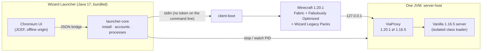

<div align="center">


# Wizard Launcher

**The one-click portal to _Witchcraft & Wizardry_.**<br>
A hand-built 1.16.5 castle, played on a modern 1.20.1 client, from a launcher that feels like a product rather than a script.

[](https://github.com/ducky-lang/wizard_launcher/actions/workflows/build.yml)
[](https://github.com/ducky-lang/wizard_launcher/releases/latest)


[**Download**](https://github.com/ducky-lang/wizard_launcher/releases/latest) ·
[Features](#features) ·
[How it works](#how-it-works) ·
[Legacy packs](#native-legacy-resource-packs) ·
[Security](#security) ·
[Build](#building-from-source)

</div>

---

## Highlights

<table>
<tr>
<td width="33%" valign="top">

### Plays offline
Once installed, **Play never touches the network**. Every install step is fingerprinted, so a warm launch does no downloads and no re-hashing. **Offline bundles** can move a whole install to a computer that has never been online.

</td>
<td width="33%" valign="top">

### Half the memory
The 1.16.5 world server and the ViaProxy version bridge share **one JVM**. With tuned G1 flags the heap grows only when the castle needs it and shrinks back afterwards. At idle this measured **~830 MB, down from ~1620 MB**.

</td>
<td width="33%" valign="top">

### Old packs, read natively
A bundled Fabric mod teaches Minecraft 1.20.1 to **read 1.13–1.19 resource packs directly**. There is no conversion step and no copy of the pack, and the original files are never modified.

</td>
</tr>
<tr>
<td valign="top">

### Chromium interface
A fast, polished UI rendered by an embedded Chromium engine (JCEF). Motion is limited to page transitions and GPU-friendly effects, nothing redraws while the window is idle, and *reduced motion* is fully honoured.

</td>
<td valign="top">

### Secure by default
- Pinned hashes on every download, checked on each redirect hop.
- The access token never appears on a command line.
- Refresh tokens live in the OS keychain.
- The Log4Shell fix the 1.16.5 server actually needs.
- A UI engine that cannot reach the internet.

</td>
<td valign="top">

### Everything in one place
- Multiple accounts.
- Mod, resource pack and shader manager.
- Screenshot gallery.
- World backups and restore.
- Live console and crash assistant.
- Tray mode, and English and Vietnamese.

</td>
</tr>
</table>

---

## Features

| Area | What you get |
|---|---|
| **Play** | One button installs, repairs and launches. It shows staged progress (castle → game files → mods → portal → launch) with live speed. The world boots while Minecraft loads, and Minecraft waits on an *Opening the castle gates…* screen, then joins by itself as soon as the world is ready. The world saves and stops by itself when Minecraft exits, even if the launcher was closed. |
| **Accounts** | Microsoft sign-in with a device code, so your password is only typed on Microsoft's site. Offline players are also supported, and you can switch between several accounts with one click. Signed-in players keep playing when offline, using their saved profile. |
| **Library** | Mods: enable, disable, add and remove, with modpack mods protected. Resource packs: enable, disable, add and remove, with 1.16.5 packs badged as *read natively* and an optional export to a 1.20.1 zip. Shader packs: add and remove. |
| **Screenshots** | A gallery with thumbnails cached on disk, a lightbox with keyboard navigation, and open and delete actions. |
| **World** | Size and last-played information, one-click backups, restore from any backup, and a reset that always backs up first. A **world self-test** boots the server, pings it as a 1.20.1 client, reports memory, then stops it and saves. |
| **Console** | Live, filterable output from the launcher, world server and bridge, with copy and open-folder actions. |
| **Crash assistant** | If Minecraft exits abnormally, the matching crash report is surfaced with a summary and a copy button. |
| **Settings** | Memory profiles and sliders, window size, fullscreen, custom Java, offline mode, LAN play, launcher behaviour while playing (stay, tray, close), animations, hardware acceleration, and log retention. |
| **Maintenance** | Repair game files (full hash verification), export and import offline bundles, block-state rules, and the data folder. |
| **Shortcuts** | <kbd>Ctrl</kbd>+<kbd>Enter</kbd> plays · <kbd>Ctrl</kbd>+<kbd>1</kbd>…<kbd>6</kbd> switches pages · <kbd>Esc</kbd> closes dialogs · <kbd>←</kbd>/<kbd>→</kbd> browse screenshots |

---

## How it works



| Module | Language | Role |
|---|---|---|
| `launcher-app` | Kotlin | JCEF window, UI bridge, tray, CLI, classic Swing fallback, jpackage images |
| `launcher-core` | Kotlin | Offline-first installers, Microsoft auth, secret storage, process supervision, library services |
| `server-host` | Java | Runs the 1.16.5 server and ViaProxy side by side in one JVM, and saves on exit |
| `client-boot` | Java | Receives the game arguments over stdin and starts Minecraft |
| `pack-legacy` | Java | The translation engine for older resource packs, shared by the mod and the export tool |
| `legacy-mod` | Java (Fabric) | Serves older packs to 1.20.1 through a translating resource layer, and holds the one-click join until the world is ready |

The installer carries its own Java 17 runtime. That single runtime runs the launcher, the client and the world server, so there is no Java to download, find or configure.

---

## Native legacy resource packs

The castle's resource pack was made for **1.16.5** (`pack_format` 6). Instead of converting it, the bundled **Wizard Legacy Packs** mod reads it directly. When Minecraft opens the selected packs, each older pack is wrapped in a layer that answers the game's resource requests the way a 1.20.1 pack would. The files on disk stay exactly as they are.

| What 1.20.1 changed | How the pack is read |
|---|---|
| 1.19.3 stitches only `block/` and `item/` textures into the block atlas | An `atlases/blocks.json` is generated for every other texture that models use |
| `grass_path` became `dirt_path`; squid, cauldron and glint textures moved (1.17–1.19.4) | Aliases and reference rewrites; the cauldron's `level` states are split into `cauldron` and `water_cauldron` |
| 1.20 removed the `legacy_unicode` font provider (custom GUI glyphs) | Pages become `bitmap` providers cropped by `glyph_sizes.bin`; blank sized glyphs become `space` advances |
| 1.17 post shaders require GLSL 150 | `attribute`/`varying`, `gl_FragColor` and `texture2D` are upgraded |
| Older `pack_format` is flagged *incompatible* | The pack is listed as compatible |

Any pack from **1.13 to 1.19.4** benefits, with rules gated by the version each change arrived in. A report for every pack is written to `logs/wizard-legacy-packs/`.

Adaptation runs on a background thread, so the game keeps answering the world while a large pack loads. The result is cached in memory and under `cache/wizard-legacy-packs/`. The cache is keyed by the pack's files, the rules and the adapter revision, so later launches reuse it and any change to the pack is picked up. A file the game lists but cannot read is skipped with a note in the report instead of failing the whole pack.

### Defining block states

Packs, or you, can declare extra rules in `wizard-states.json`. Put it in the pack root, or open it from **Settings → Maintenance → Block state rules**:

```json
{
  "format": 1,
  "states": {
    "minecraft:note_block": {
      "instrument=harp,note=1,powered=false": { "model": "wizard:block/crystal_ball" }
    }
  },
  "items": {
    "minecraft:stick": [
      { "predicate": { "custom_model_data": 1001 }, "model": "wizard:item/wand" }
    ]
  },
  "split_blockstates": [
    { "from": "minecraft:cauldron", "when": { "level": "1|2|3" }, "to": "minecraft:water_cauldron" }
  ],
  "rename_references": { "models": {}, "textures": {} },
  "copy_files": [],
  "lang_keys": {}
}
```

**Known limits:**
- Features specific to OptiFine depend on client mods.
- Shaders built on fixed-function GLSL cannot be translated.
- The 1.20 smithing GUI has a different layout.
- Every case that cannot be translated is listed in the pack report.

---

## Security

| | |
|---|---|
| **Downloads** | HTTPS with TLS 1.2 or later. Each purpose (Mojang/Fabric, Modrinth, map host) has its own host allow-list, checked on every redirect hop. Files are verified against SHA-1, SHA-256 or SHA-512 digests before they appear, with size caps and atomic writes. |
| **Archives** | Zip-slip and zip-bomb protection; staged extraction that is swapped in only when complete. |
| **Catalog** | A replacement catalog is accepted only with a valid Ed25519 signature from the key compiled into the build. |
| **Tokens** | The Minecraft access token exists only in memory and reaches the game over a pipe, never on the command line (a test enforces this). The Microsoft refresh token is stored with DPAPI, the macOS Keychain or the Secret Service, falling back to AES-GCM. Logs redact tokens. |
| **World server** | Loopback only; RCON, query and JMX are off; a whitelist is bound to the player's offline UUID. The 1.16.5 server ships Log4j 2.8.1, where `formatMsgNoLookups` does nothing, so it runs with Mojang's `%msg{nolookups}` configuration plus JNDI and RMI hardening. Its JVM cannot open outbound URL connections at all. |
| **UI engine** | Pages are served from a private `https://wizard-launcher.invalid` origin with a strict Content-Security-Policy. Chromium runs with no proxy and a resolver that maps every hostname to *not found*, so the interface cannot contact the internet. External links open in your own browser. |
| **Game files** | Bundled `server.jar` and `ViaProxy.jar` are pinned by hash. A full **Repair** re-verifies every library and asset. |
| **Processes** | Identified by PID *and* start time, so a recycled PID is never mistaken for one of ours. |

---

## Offline play

- The first launch downloads the castle, Minecraft 1.20.1, Fabric and the modpack once. After that, **Play works with the network cable unplugged**.
- **Settings → Offline mode** forbids all network access.
- **Export offline bundle** packs the game, libraries, assets, mods and cached content into one `.wizardpack`. **Import offline bundle** installs it on another computer. Bundles are verified file by file, and a damaged or tampered bundle changes nothing.
- A Microsoft account keeps working offline with its saved profile, because the local world server does not check tokens.

---

## Installing

Download the installer for your system from the [latest release](https://github.com/ducky-lang/wizard_launcher/releases/latest):

| System | File |
|---|---|
| Windows 10/11 (64-bit) | `WizardLauncher-Windows-Setup-<version>.exe` (per-user install, no admin prompt) |
| macOS (Apple silicon) | `WizardLauncher-macOS.dmg` |
| Linux (x86_64) | `WizardLauncher-Linux-x86_64.AppImage` |

Verify the file against `SHA256SUMS.txt`.

Your world, settings and logs live in the data folder, and uninstalling never deletes them unless you ask:
- Windows: `%LOCALAPPDATA%\WizardLauncher`
- macOS: `~/Library/Application Support/WizardLauncher`
- Linux: `$XDG_DATA_HOME/WizardLauncher`

---

## Command line

```text
WizardLauncher                                   open the launcher
WizardLauncher --classic                         open the lightweight Swing interface
WizardLauncher --play [--name <player>]          install if needed and play, no window
WizardLauncher --verify-install                  install or repair the game and check every file
WizardLauncher --world-selftest                  start the world and bridge, ping as 1.20.1, stop
WizardLauncher --smoke-client [--pack p.zip]     start Minecraft briefly and check it loads
WizardLauncher --export-pack <in> <out.zip>      write a 1.20.1-format copy of an older pack
WizardLauncher --export-bundle <file>            pack this install for an offline computer
WizardLauncher --import-bundle <file>            install from an offline bundle
WizardLauncher --catalog-keygen | --catalog-sign <catalog.json>
```

`WIZARD_LAUNCHER_DATA` points the launcher at another data folder, which is useful for portable installs and testing.

---

## Building from source

You need JDK 17 or newer.

```bash
./gradlew build                                   # compile and run every test
./gradlew fetchGameJars                           # download and verify the pinned server and bridge jars
./gradlew -p legacy-mod build                     # build the Fabric legacy-pack mod
./gradlew :launcher-app:run                       # run from source
./gradlew :launcher-app:jpackage                  # self-contained app image for this OS
./gradlew :launcher-app:jpackage -PjpackageType=dmg
```

CI (`.github/workflows/build.yml`) does the following:
- Runs the tests.
- Builds the mod.
- **Installs the real game on Windows, macOS and Linux**.
- Starts Minecraft 1.20.1 with a generated 1.16.5 pack under a virtual display.
- Builds installers for all three platforms, with SHA-256 checksums.

Running the workflow manually, or pushing a `v*.*.*` tag, publishes a release.

Microsoft sign-in needs a public Azure application id, passed as the `MC_LAUNCHER_CLIENT_ID` environment variable or repository secret. Without it, players use offline names.

---

## Credits

- **Map:** *Witchcraft and Wizardry* by [The Floo Network](https://www.thefloonetwork.net/).
- **Launcher:** Foxy (.phungminh).
- **Built on:**
  - [Fabric](https://fabricmc.net/)
  - [Fabulously Optimized](https://modrinth.com/modpack/fabulously-optimized)
  - [ViaProxy](https://github.com/ViaVersion/ViaProxy)
  - [JCEF](https://github.com/chromiumembedded/java-cef) via [jcefmaven](https://github.com/jcefmaven/jcefmaven)
  - [FlatLaf](https://www.formdev.com/flatlaf/)

Minecraft is a trademark of Mojang Studios. This project is not affiliated with Mojang or Microsoft.
